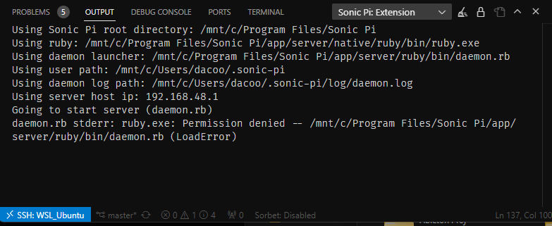
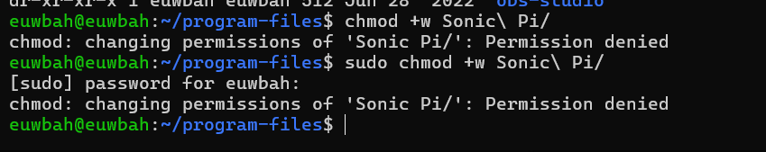

# xenchord

Helper methods/classes for livecoding just intonation music in Sonic Pi.

(work in progress)

## Configuration

See variables in in [prelude_for_livecoding.rb](/prelude_for_livecoding.rb)

## Development

> &nbsp;
> #### VERY HACKY
>
> ⚠️ This is my personal, extremely scuffed, tooling setup for writing ruby & running Sonic Pi.
> A lot of this can be simplified once [Shopify/ruby-lsp](https://github.com/Shopify/ruby-lsp/) and [Shofipy/vscode-ruby-lsp](https://github.com/Shopify/vscode-ruby-lsp) is fixed on Windows.
>
>
> Track the PRs regarding the issues here:
>
> - https://github.com/Shopify/ruby-lsp/pull/841
> - https://github.com/Shopify/vscode-ruby-lsp/pull/712
>
> &nbsp;

To get a semantic highlighting & autocomplete suggestions, use [ruby-lsp](https://github.com/Shopify/ruby-lsp).

-----

## Overview of my livecoding/dev setup

> This guide is written as a note-to-self in case I have to do this again in the future. Hopefully this is helpful for anyone else who also wants to do something similar.

- OS: Windows 11
- WSL2 OS: Ubuntu 22.04
- Editor: VSCode
- Sonic Pi: v4.4.0
- Sonic Pi Client/Editor: [euwbah/vscode-sonic-pi](https://github.com/euwbah/vscode-sonic-pi)

Both ruby-lsp and ruby-lsp-vscode is currently broken on Windows. As a workaround, I use Remote-SSH to connect VSCode to a vscode-server running in WSL and install the ruby-lsp extension remotely.

### On getting Ruby-LSP support in VSCode on Windows using Ubuntu WSL2. [[WORKAROUND]](#very-hacky)

Written rather verbosely so hopefully someone without linux knowledge can follow along.

- Install WSL2 from Microsoft store & Ubuntu 22 on WSL
    - **Run Ubuntu** & don't close it (It doesn't run in the background and will shut down if you close it)
- Install OpenSSH server on Ubuntu WSL
    - `sudo apt-get install openssh-server`
- Change WSL Ubuntu's SSH port to something other than the default 22 otherwise it will conflict with Windows' own SSH server which runs if developer mode is enabled.
    - `sudo nano /etc/ssh/sshd_config`: Open SSH server config file in `nano` editor.
    - Change `#Port 22` to `Port 2222` (or whatever port you want)
    - `sudo service ssh restart`
    - ⚠️ **Remember this port**. You will need to use this port when connecting to WSL Ubuntu from Windows.
- Install "Remote - SSH" VSCode extension to run VSCode inside WSL & open a VSCode SSH session into WSL.
- Setup Windows SSH configuration file to add Ubuntu WSL as a SSH host.
    - After installing "Remote - SSH" in VSCode, search for "Remote-SSH: Open Configuration File..." in the command palette.
    - Use the config file located in `C:\Users\<username>\.ssh\config` (or create it if it doesn't exist)
    - Inside it, write this:
        ```
        Host <name>
            HostName localhost
            Port <port>
            User <username>
        ```
        - Replace `<name>` with whatever you want to call the host (e.g. WSL_Ubuntu). Don't use spaces.
        - Replace `<port>` with the port you just set in the SSH server config file (e.g. 2222)
        - Replace `<username>` with your Ubuntu WSL username you configured (which may not be the same as your Windows username!)
- 🟢 **In order to not have to type Ubuntu password every connection:**
    - On Windows, create an SSH keypair using `openssl` if you don't already have one. [GitHub's guide on how to create/check for existing SSH keys](https://docs.github.com/en/authentication/connecting-to-github-with-ssh/adding-a-new-ssh-key-to-your-github-account?platform=windows)
        - After generating, you should find a public key like `~/.ssh/id_ed25519.pub` inside your user directory.
        - Open the `.pub` file with Notepad & copy the contents (that will be one of your device's public key)
    - Now in Ubuntu, paste public key into `~/.ssh/authorized_keys` on a new line. Create the file if it doesn't already exist.
    - `eval $(ssh-agent)`: Start ssh-agent
    - `ssh-add`: Add authorized keys'
    - `sudo service ssh restart`: Restart SSH server
- Install homebrew in WSL Ubuntu (linuxbrew)
    - `/bin/bash -c "$(curl -fsSL https://raw.githubusercontent.com/Homebrew/install/HEAD/install.sh)"`
    - Make sure to follow the **'Next steps:'** instructions after the script runs.
        - It will ask you to `sudo apt-get install build-essential gcc` if you don't have those packages already, which you should do.
        - Ensure that `~/.profile` contains the line `eval "$(/home/linuxbrew/.linuxbrew/bin/brew shellenv)"`, otherwise the `brew` command & shell enviroment won't be available.
    - Run `source ~/.profile` to update changes on your current terminal session (or just re-login/restart Ubuntu)
- Install ruby with brew on WSL Ubuntu
    - `brew install ruby-install`
    - Check command works: `ruby-install -V`
    - Install ruby: `ruby-install ruby 3.2.2` (or whatever version Sonic Pi is using now)
- Install chruby with brew on WSL Ubuntu
    - `brew install chruby`
    - ⚠️ **NOTE:** Because it is installed with brew, chruby will be located in `/home/linuxbrew/.linuxbrew/opt/chruby/share/chruby`, instead of `/usr/local/share/chruby`.
    - Add chruby to `~/.bashrc`:
        - `source /home/linuxbrew/.linuxbrew/opt/chruby/share/chruby/chruby.sh`
        - To enable auto context switching based on a `.ruby-version` file in the current directory, also add:
        `source /home/linuxbrew/.linuxbrew/opt/chruby/share/chruby/auto.sh`
    - Run `source ~/.bashrc` to update changes (or open a new terminal session)
- Clone this repository in Ubuntu and run `bundle install` to install ruby dependencies.
- For the vscode-ruby-lsp extension to work:
    - `cd /path/to/project`.
        - ⚠️ The project's chruby environment must be activated so that the ruby-lsp install will be located at the right place.
    - `gem install ruby-lsp`.
        - With chruby active, this should install into `~/.gem/ruby/3.2.2/bin/ruby-lsp`
        - Make sure you can run `ruby-lsp` from inside the project directory in the terminal without error.
- For Solargraph VSCode extension to work:
    - `cd ~`: **Exit project directory**. Don't install the solargraph gem in the project's chruby 'sandbox' environment. VSCode uses the `solargraph` that is accessible from inside `~/.vscode-server/`.
        - 🟠 This can be changed by modifying the `solargraph.commandPath` setting in VSCode, but you'd have to do it every project.
    - `gem install solargraph'
    - Inside Make sure you can run `solargraph` from inside `~/.vscode-server` in the terminal without error.
        - `which solargraph` should give `/usr/local/bin/solargraph`.

### On networking between Ubuntu/WSL2 and Windows host

🟢 Based on ["Accessing network applications with WSL" - Learn/Windows/Development Environment/WSL/Concepts](https://learn.microsoft.com/en-us/windows/wsl/networking). Check link for more up-to-date info.

#### Sending data from windows to WSL2

Simply use `localhost:<port>` to access & point to networking apps running on WSL2. The ports are the same as whatever outgoing ports you use on WSL2.

#### Sending data from WSL2 to Windows

- `cat /etc/resolv.conf` and look for `nameserver <some ip address>`
- That's the IP address to use to connect from inside WSL2 to the Windows host outside.
- Using `localhost` inside WSL2 will point towards WSL2 itself only.

### On file permissions in WSL2

> Sonic Pi requires read, write & execute permissions for all files in the installation directory (`Program Files/Sonic Pi`) and user data (`~/.sonic-pi`) to run.

Assuming knowledge of [basic linux file permissions](https://www.guru99.com/file-permissions.html) and [how to view permissions of files/directories](https://detailed.wordpress.com/2017/10/28/understanding-ls-command-output/).

Then read these:

- [File Permissions for WSL](https://learn.microsoft.com/en-us/windows/wsl/file-permissions)
- [Automount settings](https://learn.microsoft.com/en-us/windows/wsl/wsl-config#automount-settings)

#### Giving Sonic Pi installation directory write perms in WSL2.

By default, the folders in Program Files do not have write access, which is a problem for Sonic Pi:



Trying to `chmod` to give write permissions gives:



> Related: https://superuser.com/questions/1323645/unable-to-change-file-permissions-on-ubuntu-bash-for-windows-10


##### 1. Allow WSL2 to store metadata on mounted Windows drives to support linux file perms.

- `sudo nano /etc/wsl.conf` to modify the WSL config file (you'll need sudo)
- Add/modify the following lines to include the `metadata` option under `[automount]`:
    ```
    [automount]
    options = "metadata"
    ```
    - This will allow WSL2 to add metadata to Windows files to support linux file perms.
    - 🟢 By default, umask is set to `022`, fmask & dmask to `000`. This should work.
    - [Read more here](https://learn.microsoft.com/en-us/windows/wsl/wsl-config#automount-options)
- Save changes to `/etc/wsl.conf`
- Shut down **all linux instances** in WSL:
    - In Windows powershell: `wsl --shutdown`
- Check `wsl --list --running` and make sure no distributions are running.
- [Once all linux instances are stopped, wait at least 8 seconds](https://learn.microsoft.com/en-us/windows/wsl/wsl-config#the-8-second-rule)
- Restart Ubuntu.

##### 2. Set "Full Control" permissions for `Program Files\Sonic Pi`

- In Windows File Explorer, right click the `Sonic Pi` directory in Program Files and select `Properties`.
- Go to the `Security` tab.
- Edit permissions for the `USERS` group: set to Full Control.
- Apply & Ok
- Wait for new permissions to be recursively applied to all files in this directory (takes about 1 min)

### On the Sonic Pi VSCode extension when running in remote SSH mode

VSCode Extensions like vscode-sonic-pi will be installed and run within the WSL2 virtual machine, not on the windows host. It appears that Sonic Pi currently doesnn't support executing the Server and GUI Client on two "separate" IPs. The Sonic Pi entry point, [`daemon.rb`](https://github.com/sonic-pi-net/sonic-pi/blob/dev/app/server/ruby/bin/daemon.rb), starts OSC API servers that listens to localhost (127.0.0.1). Using WSL2 to start the Sonic Pi daemon will make the server listen to WSL2's IP, which cannot be accessed from the Windows host.

It is unclear whether the Scsynth/Sonic Pi daemon is actually being run on the Windows Host or WSL2 Hyper-V (it depends on what VSCode's Remote-SSH actually does).

On the bright side, [it is possible to port-forward WSL2 to LAN](https://jwstanly.com/blog/article/Port+Forwarding+WSL+2+to+Your+LAN/). So an actual solution would be to run the entire setup in Ubuntu (installing Sonic Pi in Ubuntu, etc...). However, I don't trust WSL2's networking & audio to be stable enough for livecoding given this issue: [Can't access UDP services running in WSL on localhost](https://github.com/microsoft/WSL/issues/8783)

## Notes to self

Referencing Sonic Pi's "global-scope context" inside classes requires using the `$GLO` prefix defined in [prelude_for_livecoding.rb](/prelude_for_livecoding.rb) as Sonic Pi's global context is different from the scope which classes are defined in (which are actually default Ruby global scope).

The project repo is structured like a Gem for organization purposes & better support with extensions/linters/lsp/plugins, but it's not meant to ship as one.

Ruby dev on windows is cursed.
